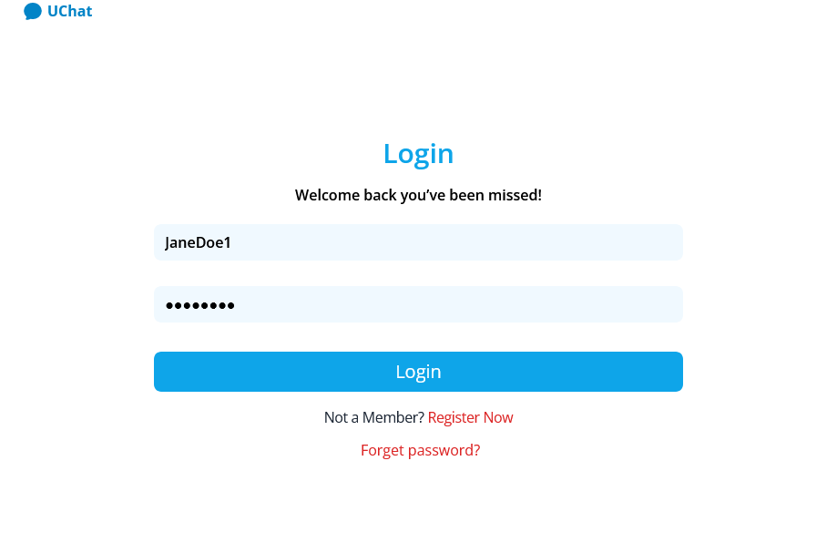
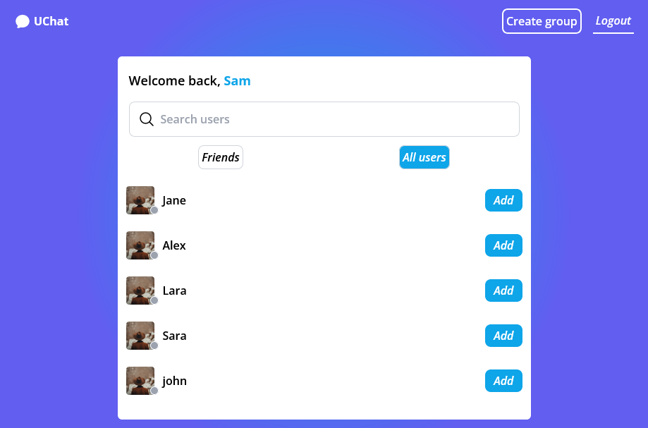
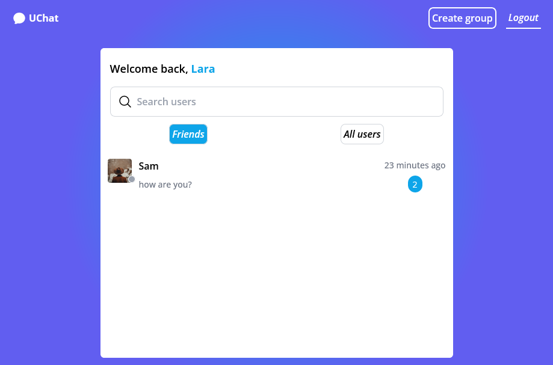
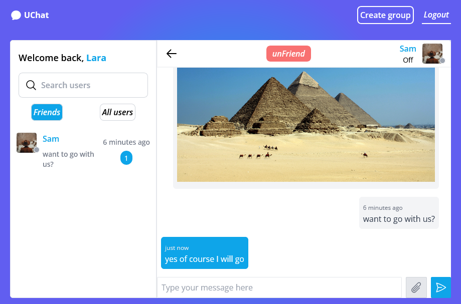
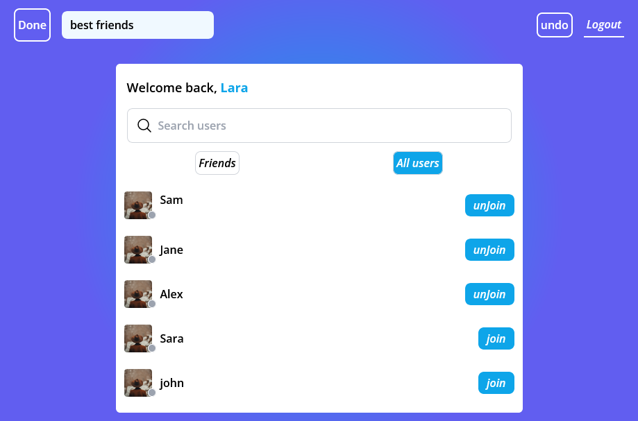
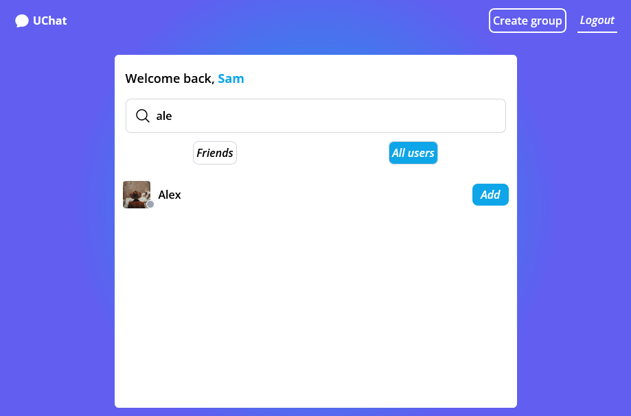

# MERN STACK chat app

## Description

A real time chat app that you can create account into and start chatting with other users and create chat groups too

## Technologies

- React
- Node
- MongoDB
- React router
- Tailwind
- JWT
- and more

## Current features

- Add users => to be contacts
- Create group chats
- Also delete contacts
- auth

## upcoming features

- More advanced auth system
- profile page with the appility to upload photo
- add the ability to block a user
- add the ability to remove / update a single message
- etc

## Branches

- main => will have all these features
- authjwt => will have a more advanced JWT auth system => comming

## Getting started

- git clone https://github.com/hebam17/chat-app

1- Open a first terminal and run

```
cd ./client
npm install
npm run dev
```

2- create a .env file and fill the needed variables => mentioned in ** env-map.json **

3- Open your second terminal and run

```
cd ./api
npm install
npm run dev
```

2- create a .env file and fill the needed variables => mentioned in ** env-map.json **

Now you run the project







